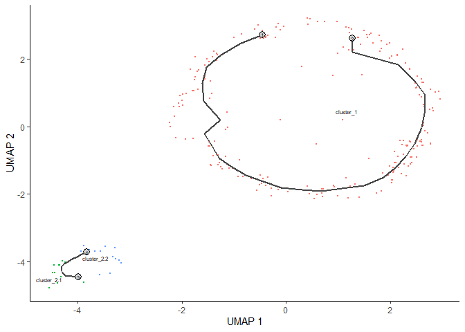

Bioinformatic analysis of ‘single-nuclei RNA sequencing’ from mouse
brain with microglia deficient in mitochondrial complex I
================
Máximo Domínguez Guerrero, Juan José Pérez Moreno, Alberto Pascual Bravo

# Setup

Load packages:

``` r
library(AnnotationDbi)
library(ComplexHeatmap)
library(EnhancedVolcano)
library(HGNChelper)
library(Seurat)
library(VennDetail)
library(dplyr)
library(garnett)
library(ggplot2)
library(ggpubr)
library(ggVennDiagram)
library(harmony)
library(monocle3)
library(openxlsx)
library(org.Mm.eg.db)
```

Load functions:

``` r
source("R/filter_cells.R")
source("R/assign_group.R")
source("R/extract_module.R")
```

# Analysis of snRNA-seq data: Seurat vs Monocle3

## Seurat processing

Seurat reads three archives (in a same folder): matrix.mtx, features.tsv
and barcodes.tsv

``` r
CTR.data <- Read10X(data.dir = "data_Seurat/CTR")
MUT.data <- Read10X(data.dir = "data_Seurat/MUT")
```

First, we create the Seurat Object:

``` r
CTR <- CreateSeuratObject(counts = CTR.data, project = "Control", 
                          min.cells = 3, min.features = 200)
```

We can visualize the number of genes and number of UMIs distribution
with violin plots. It is also recommended to compare the linearity
between both variables:

``` r
(violin_CTR_pre <- VlnPlot(CTR, features = c("nFeature_RNA", "nCount_RNA"), ncol = 2) & 
  theme(axis.title.x = element_blank(), 
        axis.text.y = element_text(size = rel(0.45), angle = 90),
        axis.text.x = element_text(size = rel(0.7),  angle = 00),
        plot.title = element_blank()))
```

<!-- -->

``` r
(feature_CTR_pre <- FeatureScatter(CTR, feature1 = "nCount_RNA", feature2 = "nFeature_RNA") + 
  geom_smooth(method = "lm") & 
  theme(legend.position = "none",
        axis.title.y = element_text(size = rel(0.5), angle = 90),
        axis.text.y = element_text(size = rel(0.45), angle = 90),
        axis.title.x = element_text(size = rel(0.5),  angle = 00),
        axis.text.x = element_text(size = rel(0.45),  angle = 00),
        plot.title = element_text(size = rel(0.7), angle = 00)))
```

<!-- -->

Now, we will remove unwanted cells from the dataset, based on the next
rule: we will remove cells which gene expression is above or below two
times the standard deviance from the mean.

``` r
CTR <- filter_cells(CTR)
```

After filtering, we can visualize again the plots:

``` r
(violin_CTR_post <- VlnPlot(CTR, features = c("nFeature_RNA", "nCount_RNA"), ncol = 2) & 
  theme(axis.title.x = element_blank(), 
        axis.text.y = element_text(size = rel(0.45), angle = 90),
        axis.text.x = element_text(size = rel(0.7),  angle = 00),
        plot.title = element_blank()))
```

<!-- -->

``` r
(feature_CTR_post <- FeatureScatter(CTR, feature1 = "nCount_RNA", feature2 = "nFeature_RNA") + 
  geom_smooth(method = "lm") & 
  theme(legend.position = "none",
        axis.title.y = element_text(size = rel(0.5), angle = 90),
        axis.text.y = element_text(size = rel(0.45), angle = 90),
        axis.title.x = element_text(size = rel(0.5),  angle = 00),
        axis.text.x = element_text(size = rel(0.45),  angle = 00),
        plot.title = element_text(size = rel(0.7), angle = 00)))
```

<!-- -->

We repeat the same processing: first, we create the Seurat Object:

``` r
MUT <- CreateSeuratObject(counts = MUT.data, project = "MGcCI", 
                          min.cells = 3, min.features = 200)
```

We visualize the key plots:

``` r
(violin_MUT_pre <- VlnPlot(MUT, features = c("nFeature_RNA", "nCount_RNA"), ncol = 2) & 
  theme(axis.title.x = element_blank(), 
        axis.text.y = element_text(size = rel(0.45), angle = 90),
        axis.text.x = element_text(size = rel(0.7),  angle = 00),
        plot.title = element_blank()))
```

<!-- -->

``` r
(feature_MUT_pre <- FeatureScatter(MUT, feature1 = "nCount_RNA", feature2 = "nFeature_RNA") + 
  geom_smooth(method = "lm") & 
  theme(legend.position = "none",
        axis.title.y = element_text(size = rel(0.5), angle = 90),
        axis.text.y = element_text(size = rel(0.45), angle = 90),
        axis.title.x = element_text(size = rel(0.5),  angle = 00),
        axis.text.x = element_text(size = rel(0.45),  angle = 00),
        plot.title = element_text(size = rel(0.7), angle = 00)))
```

<!-- -->

Filter:

``` r
MUT <- filter_cells(MUT)
```

And visualize after the filtering:

``` r
(violin_MUT_post <- VlnPlot(MUT, features = c("nFeature_RNA", "nCount_RNA"), ncol = 2) & 
  theme(axis.title.x = element_blank(), 
        axis.text.y = element_text(size = rel(0.45), angle = 90),
        axis.text.x = element_text(size = rel(0.7),  angle = 00),
        plot.title = element_blank()))
```

<!-- -->

``` r
(feature_MUT_post <- FeatureScatter(MUT, feature1 = "nCount_RNA", feature2 = "nFeature_RNA") + 
  geom_smooth(method = "lm") & 
  theme(legend.position = "none",
        axis.title.y = element_text(size = rel(0.5), angle = 90),
        axis.text.y = element_text(size = rel(0.45), angle = 90),
        axis.title.x = element_text(size = rel(0.5),  angle = 00),
        axis.text.x = element_text(size = rel(0.45),  angle = 00),
        plot.title = element_text(size = rel(0.7), angle = 00)))
```

<!-- -->

Combining all plots:

``` r
(QC <- ggarrange(violin_CTR_pre, feature_CTR_pre, violin_CTR_post, feature_CTR_post, 
                 violin_MUT_pre, feature_MUT_pre, violin_MUT_post, feature_MUT_post,
                 labels = c("A", "B", "C", "D", "", "", "", ""),
                 ncol = 4, nrow = 2))
```

<!-- -->

Once we have filtered the data, we will merge the data in only one
Seurat Object:

``` r
CTR <- AddMetaData(CTR, metadata="CTR", col.name="Condition")
MUT <- AddMetaData(MUT, metadata="MUT", col.name="Condition")

merged_seurat <- merge(x = CTR,
                       y = MUT,
                       add.cell.ids = c("CTR", "MUT"),
                       merge.data = TRUE)
```

Thus, we will perform log-normalization, scale and feature selection to
continue the analysis.

``` r
merged_seurat <- merged_seurat %>%
  NormalizeData() %>%
  FindVariableFeatures(selection.method = "vst", nfeatures = 2000) %>% 
  ScaleData()
```

We will calculate the Principal Components from Principal Component
Analysis (PCA) using variable features just calculated. The PCA will
build a lower dimensional space which we can draw cells.

``` r
merged_seurat <- RunPCA(merged_seurat, assay = "RNA", npcs = 100)
```

In this point, we want to check batch effect and correct it. To do this
we will perform Harmony:

``` r
harmonized_seurat <- RunHarmony(merged_seurat, 
                                group.by.vars = c("Condition"), 
                                reduction = "pca", assay.use = "RNA", 
                                reduction.save = "harmony")
```

Once the batch effect is corrected, we can perform UMAP. To find
clusters we will perform Leiden algorithm (set as 4 in `FindClusters`)

``` r
harmonized_seurat <- RunUMAP(harmonized_seurat, reduction = "harmony", 
                             assay = "RNA", dims = 1:100)


harmonized_seurat <- FindNeighbors(object = harmonized_seurat, reduction = "harmony")
harmonized_seurat <- FindClusters(harmonized_seurat,
                                  resolution = c(0.2, 0.4, 0.6, 0.8, 1.0, 1.2),
                                  algorithm = 4)
```

We need to identify each cluster. To do this we will follow scType
workflow. We need to load some functionalities from github: the gene set
preparation function and the cell type annotation function:

``` r
# load gene set preparation function
source("https://raw.githubusercontent.com/IanevskiAleksandr/sc-type/master/R/gene_sets_prepare.R")
# load cell type annotation function
source("https://raw.githubusercontent.com/IanevskiAleksandr/sc-type/master/R/sctype_score_.R")
```

Next, we will prepare gene sets from the input cell marker file. We will
use the gene set prepared from scType:

``` r
db_ = "https://raw.githubusercontent.com/IanevskiAleksandr/sc-type/master/ScTypeDB_full.xlsx";
tissue = "Brain"

gs_list = gene_sets_prepare(db_, tissue)
```

To run scType we need to extract the scaled scRNA-seq matrix from our
data:

``` r
# extract scaled scRNA-seq matrix
scRNAseqData_scaled <- as.matrix(harmonized_seurat[["RNA"]]$scale.data)

# run ScType
es.max <- sctype_score(scRNAseqData = scRNAseqData_scaled, scaled = TRUE, 
                       gs = gs_list$gs_positive, gs2 = gs_list$gs_negative)
```

Next, we need to merge the results from scType with our data to
visualize in UMAP. In addition, we have set low-confident clusters to
“unknown”.

``` r
# merge by cluster
cL_resutls <- do.call("rbind", lapply(unique(harmonized_seurat@meta.data$seurat_clusters), function(cl){
  es.max.cl = sort(rowSums(es.max[ ,rownames(harmonized_seurat@meta.data[harmonized_seurat@meta.data$seurat_clusters==cl, ])]), decreasing = !0)
  head(data.frame(cluster = cl, type = names(es.max.cl), scores = es.max.cl, ncells = sum(harmonized_seurat@meta.data$seurat_clusters==cl)), 10)
}))
sctype_scores <- cL_resutls %>% group_by(cluster) %>% top_n(n = 1, wt = scores)  

# set low-confident (low ScType score) clusters to "unknown"
sctype_scores$type[as.numeric(as.character(sctype_scores$scores)) < sctype_scores$ncells/4] <- "Unknown"

# Overlay the identified cell types on UMAP plot: 
harmonized_seurat@meta.data$customclassif = ""
for(j in unique(sctype_scores$cluster)){
  cl_type = sctype_scores[sctype_scores$cluster==j,]; 
  harmonized_seurat@meta.data$customclassif[harmonized_seurat@meta.data$seurat_clusters == j] = as.character(cl_type$type[1])
}
```

Plotting the results:

``` r
(umap_Seurat <- DimPlot(harmonized_seurat, reduction = "umap", 
                        label = TRUE, repel = TRUE, 
                       label.size = 2.5, group.by = 'customclassif') & 
  theme(plot.title = element_blank(),
        axis.title.x = element_text(size = rel(0.7),  angle = 00),
        axis.title.y = element_text(size = rel(0.7), angle = 90),
        axis.text.y = element_text(size = rel(0.7), angle = 90),
        axis.text.x = element_text(size = rel(0.7),  angle = 00),
        legend.position = "none")) 
```

<!-- -->

Furthermore, the clusters identified by scType are:

``` r
table(harmonized_seurat$customclassif)
```

    ## 
    ##                      Astrocytes                    Cancer cells 
    ##                            1654                             712 
    ##               Endothelial cells               GABAergic neurons 
    ##                             424                            5571 
    ##           Glutamatergic neurons                  Mature neurons 
    ##                             698                            2938 
    ##                Microglial cells Oligodendrocyte precursor cells 
    ##                             594                            1102 
    ##                Oligodendrocytes                       Tanycytes 
    ##                            3125                            2728 
    ##                         Unknown 
    ##                            3329

Finally, we will subset microglia cells from brain data, to its
analysis:

``` r
Microglia_Seurat <- subset(harmonized_seurat, customclassif == "Microglial cells")

(umap_Microglia_Seurat <- DimPlot(Microglia_Seurat, reduction = "umap", 
                                 repel = T, group.by = "Condition") & 
  theme(plot.title = element_blank(),
        axis.title.x = element_text(size = rel(0.7),  angle = 00),
        axis.title.y = element_text(size = rel(0.7), angle = 90),
        axis.text.y = element_text(size = rel(0.7), angle = 90),
        axis.text.x = element_text(size = rel(0.7),  angle = 00),
        legend.text = element_text(size = rel(0.7),  angle = 00)))
```

<!-- -->

## Monocle3 workflow

In Monocle3, we load the data providing all the folder from the output
from 10x. Data is stored in “cell_data_set” (cds) classes.

``` r
cds_CTR <- load_cellranger_data("data_Monocle/CTR_counts")
cds_MUTANTE <- load_cellranger_data("data_Monocle/MUTANTE_counts")

cds <- combine_cds(list(cds_CTR, cds_MUTANTE))
colData(cds)$sample <- factor(colData(cds)$sample, labels = c("CTR", "MUTANTE"))
```

We merge them firstly because of the absence of a pre-filter step.
Furthermore, the pre-process is executed automatically, normalizing and
running PCA in one step. First normalizes the data by log and size
factor to address depth differences, or by size factor only. Next,
preprocess_cds calculates a lower dimensional space that will be used as
the input for further dimensionality reduction.

``` r
cds <- preprocess_cds(cds, 
                      num_dim = 100, 
                      method = "PCA", 
                      norm_method = "log")
```

Next, we create the low dimensional space (UMAP):

``` r
cds <- reduce_dimension(cds, 
                        reduction_method = "UMAP",
                        max_components = 100,
                        preprocess_method = "PCA")
```

Monocle3 provides a functionality to control the batch effect:

``` r
cds <- align_cds(cds, num_dim = 100, alignment_group = "sample")
cds <- reduce_dimension(cds)
```

Now, we cluster the cells, as well as done in Seurat, with Leiden
algorithm

``` r
cds <- cluster_cells(cds, cluster_method = "leiden", 
                     reduction_method = "UMAP", resolution = 1e-5)
plot_cells(cds, color_cells_by="partition", group_cells_by="partition")
```

<!-- -->

We find top markers:

``` r
marker_test_res <- top_markers(cds, group_cells_by = "partition", 
                               reference_cells = 1000, verbose = FALSE)

top_specific_markers <- marker_test_res %>%
  filter(fraction_expressing >= 0.10) %>%
  group_by(cell_group) %>%
  top_n(3, pseudo_R2)

top_specific_marker_ids <- unique(top_specific_markers %>% pull(gene_id))

colData(cds)$assigned_cell_type <- as.character(partitions(cds))
```

The cluster identification will be done with Garnett, a package from the
Monocle3’s lab.

``` r
colData(cds)$garnett_cluster <- clusters(cds)

classifier <- readRDS("markers/mmBrain_20191017.RDS")

brain_cds <- classify_cells(cds, classifier,
                            db = org.Mm.eg.db::org.Mm.eg.db,
                            cluster_extend = TRUE,
                            cds_gene_id_type = "ENSEMBL")
```

Once the identification is done, we can plot the UMAP:

``` r
(umap_Monocle <- plot_cells(brain_cds,
                group_cells_by = "cluster_ext_type",
                color_cells_by = "cluster_ext_type",
                group_label_size = 2.5) & 
  theme(axis.title.x = element_text(size = rel(0.7),  angle = 00),
        axis.title.y = element_text(size = rel(0.7), angle = 90)))
```

<!-- -->

``` r
cell_types <- as.data.frame(table(colData(brain_cds)$cluster_ext_type))
colnames(cell_types) <- c("cell type", "number of cells")
cell_types
```

    ##                                                cell type number of cells
    ## 1               Afferent nuclei of cranial nerves VI-XII               1
    ## 2                                   Astroependymal cells            1116
    ## 3                            Cholinergic enteric neurons               1
    ## 4      Cholinergic monoaminergic and peptidergic neurons               2
    ## 5                                               CNS glia            2775
    ## 6                       D1 medium spiny neurons striatum               2
    ## 7                          Dentate gyrus granule neurons               2
    ## 8               Di- and mesencephalon excitatory neurons             246
    ## 9               Di- and mesencephalon inhibitory neurons               3
    ## 10                         Di- and mesencephalon neurons              12
    ## 11                                          Enteric glia               2
    ## 12                                       Enteric neurons              24
    ## 13                    Excitatory neurons cerebral cortex           11690
    ## 14                     Excitatory neurons hindbrain hind               7
    ## 15                           Excitatory neurons midbrain               2
    ## 16                Granule neuroblasts dentate gyrus dent               3
    ## 17                         Granule neurons dentate gyrus               2
    ## 18                                       Immature neural               3
    ## 19                                          Immune cells               1
    ## 20                     Inhibitory neurons hindbrain hind               1
    ## 21                  Inner horizontal cell olfactory bulb               1
    ## 22 Interneuron-selective interneurons cortex/hippocampus               1
    ## 23                               Mature oligodendrocytes               1
    ## 24                                             Microglia             469
    ## 25                                Neural crest-like glia             291
    ## 26                                Neuroblasts cerebellum               1
    ## 27                            Neuroblasts olfactory bulb              65
    ## 28                                               Neurons            6337
    ## 29                             Nitrergic enteric neurons               2
    ## 30                      Oligodendrocytes precursor cells              15
    ## 31                          Patch D1/D2 neurons striatum               1
    ## 32                                             Pericytes               2
    ## 33                            Peripheral sensory neurons              10
    ## 34                        Spinal cord excitatory neurons               1
    ## 35                        Spinal cord inhibitory neurons               2
    ## 36                                   Sympathetic neurons               5
    ## 37                              Telencephalon astrocytes               1
    ## 38                            Telencephalon interneurons               2
    ## 39           Telencephalon projecting excitatory neurons              24
    ## 40                      Telencephalon projecting neurons             374
    ## 41                                               Unknown             587
    ## 42                                        Vascular cells              30
    ## 43                            Vascular endothelial cells              12
    ## 44                         Vascular leptomeningeal cells               7
    ## 45                          Vascular smooth muscle cells               2

Finally, we will subset the Microglia cluster. To do this we need to
choose manually the cells, so the instruction will be shown but not
executed. We will load the data once the selection has been made.

``` r
#Microglia_Monocle <- choose_cells(brain_cds)
load("R/Microglia_Monocle.RData")

(umap_Microglia_Monocle <- plot_cells(Microglia_Monocle, 
                                     color_cells_by = "sample", 
                                     group_cells_by = "sample", 
                                     group_label_size = 2.5) & 
    theme(axis.title.x = element_text(size = rel(0.7),  angle = 00),
          axis.title.y = element_text(size = rel(0.7), angle = 90)))
```

<!-- -->

## Plotting all the results

We will plot the most interesting plots in a single one with `ggarrange`
package:

``` r
umap_brain <- ggarrange(umap_Seurat, umap_Monocle,
                        labels = c("E", ""),
                        ncol = 2, nrow = 1)

umap_microglia <- ggarrange(umap_Microglia_Seurat, umap_Microglia_Monocle,
                            labels = c("F", ""),
                            ncol = 2, nrow = 1)

(Figure1 <- ggarrange(QC,
                     ggarrange(umap_brain, umap_microglia, ncol = 2),
                     nrow = 2))
```

<!-- -->

# Differential Analysis between Mutant (CI-deficient) and Control in Microglia Cells

## Finding Differentially Expressed Genes (DEGs)

For performing differential gene expression analysis (DGEA) after
integration, we switch back to the original data to prepare it. After
this, we will find DEGs with `FindMarkers` function:

``` r
DefaultAssay(Microglia_Seurat) <- "RNA"
Idents(Microglia_Seurat) <- "Condition"

Microglia_Seurat <- JoinLayers(Microglia_Seurat)

Microglia.de.markers <- FindMarkers(Microglia_Seurat, 
                                    ident.1 = "MUT", 
                                    ident.2 = "CTR")
```

Genes, and specially DEGs, can be plotted using a volcano plot. We will
use `EnhancedVolcano` package:

``` r
(Volcano <- EnhancedVolcano(Microglia.de.markers,
                lab = rownames(Microglia.de.markers),
                pCutoff = 0.05,
                FCcutoff = 1,
                x = 'avg_log2FC',
                y = 'p_val',
                title = '',
                subtitle = '',
                caption = bquote(~Log[2]~ "fold change cutoff, 1; p-value cutoff, 0.05"),
                col = c('grey', 'grey', 'grey', 'red'),
                selectLab = c('Nav2', 'Pard3b', 'Dlgap1', 'Lrmda', 'Klf12', 'C030034L19Rik',
                              'Cadm1', 'Lrguk', 'Lhfpl2', 'Cd84', 'Slc2a9', 'Slco2b1')) + 
   theme(legend.position = "none")
)
```

<!-- -->

## Finding Significantly Expressed Genes (SEGs)

In Monocle3, the finding of SEGs is made through fitting a lineal model.
This can be made with the `fit_models` function. From this model fitted,
we will extract the important information and we will filter genes to
work only with the significant ones.

``` r
gene_fits <- fit_models(Microglia_Monocle, model_formula_str = "~sample")
fit_coefs <- coefficient_table(gene_fits)
CTRvsMUTANTE_terms <- fit_coefs %>% filter(term == "sampleMUTANTE", 
                                           status == "OK",
                                           q_value < 0.05) %>% 
  dplyr::select(gene_short_name, q_value, estimate)
```

## Comparison between DEGs and SEGs

The best way to compare how the individuals from different groups
organize between them is using a Venn diagram. We will use two packages:
`VennDetail` to create them and `ggVennDiagram` to visualize them.

``` r
geneList_Seurat <- Microglia.de.markers %>% filter(p_val_adj < 0.05 & abs(avg_log2FC) >= 1) %>% rownames()
geneListUP_Seurat <- Microglia.de.markers %>% filter(p_val_adj < 0.05 & avg_log2FC >= 1) %>% rownames()
geneListDOWN_Seurat <- Microglia.de.markers %>% filter(p_val_adj < 0.05 & avg_log2FC <= -1) %>% rownames()

geneList_Monocle <- CTRvsMUTANTE_terms$gene_short_name

vennDiagram_SeuratvsMonocle <- venndetail(list(Seurat_DEGs_UP = geneListUP_Seurat,
                                              Seurat_DEGs_DOWN = geneListDOWN_Seurat,
                                              Monocle_SEGs = geneList_Monocle))
```

It is easy to extract the gene names from the Venn object and use them
as input of Metascape (SEGs and DEGs have been calculated above)

- SEGs:

``` r
geneList_Monocle
```

    ##  [1] "Pard3b"   "Dock10"   "Srgap2"   "Pbx1"     "Cd84"     "Akt3"    
    ##  [7] "Celf2"    "Cacnb2"   "Plxdc2"   "Pip4k2a"  "Lrp1b"    "Abhd12"  
    ## [13] "Serinc3"  "Nlgn1"    "Nbea"     "Mbnl1"    "Fnip2"    "Lrba"    
    ## [19] "Fcrls"    "Bank1"    "Lingo2"   "Ptprd"    "Rsrp1"    "Apbb2"   
    ## [25] "Anxa3"    "Selplg"   "Irak2"    "Cd9"      "Nav2"     "Dlg2"    
    ## [31] "Slco2b1"  "Ctsd"     "Dlc1"     "Cacna1a"  "Plcg2"    "Cadm1"   
    ## [37] "Itga9"    "Nkain2"   "Nav3"     "Rassf3"   "Ltc4s"    "Ppm1e"   
    ## [43] "Tanc2"    "Prkca"    "Prkd1"    "Mdga2"    "Rapgef5"  "Elmo1"   
    ## [49] "Mctp1"    "Arsb"     "Lhfpl2"   "Hexb"     "Pde4d"    "Parp8"   
    ## [55] "Lrmda"    "Nrg3"     "Dleu2"    "Klf12"    "Mycbp2"   "Csmd3"   
    ## [61] "Pvt1"     "Abcd2"    "Rbfox1"   "Cadm2"    "Myo1f"    "Ptprm"   
    ## [67] "Dlgap1"   "Slc8a1"   "Nrxn1"    "Setbp1"   "Ints6l"   "Il1rapl1"
    ## [73] "Nhs"

- Upregulated DEGs:

``` r
geneListUP_Seurat
```

    ##  [1] "Lrmda"         "Anxa3"         "Klf12"         "C030034L19Rik"
    ##  [5] "Prkd1"         "Cadm1"         "Rassf3"        "Lrguk"        
    ##  [9] "Lhfpl2"        "Arsb"          "Ltc4s"         "Cd84"         
    ## [13] "Pvt1"          "Rnf121"        "Fnip2"         "Ctsd"         
    ## [17] "Abcd2"         "Slc2a9"        "Ppcdc"         "Etv4"         
    ## [21] "Cd9"           "4930517O19Rik" "Cd244a"        "Gm37229"      
    ## [25] "Gm13710"       "Apbb2"         "Rps2"          "Usp12"        
    ## [29] "Gpr137b"       "Tnfsf8"        "Colgalt1"      "Lgals9"       
    ## [33] "Rpl17"         "Gcnt1"         "Gm26714"       "Olfr111"      
    ## [37] "Idh3b"         "Npnt"          "Adgrg5"        "Dna2"         
    ## [41] "Gm37168"       "Mt1"           "Dhrs3"         "Rftn1"        
    ## [45] "Gart"          "Cd274"         "Cotl1"         "Tmem104"      
    ## [49] "Parvb"

- Upregulated DEGs and SEGs:

``` r
(sharedUPGenes <- vennDiagram_SeuratvsMonocle@result %>%
  filter(vennDiagram_SeuratvsMonocle@result$Subset == "Seurat_DEGs_UP_Monocle_SEGs") %>%
  dplyr::select(Detail))
```

    ##    Detail
    ## 1   Lrmda
    ## 2   Anxa3
    ## 3   Klf12
    ## 4   Prkd1
    ## 5   Cadm1
    ## 6  Rassf3
    ## 7  Lhfpl2
    ## 8    Arsb
    ## 9   Ltc4s
    ## 10   Cd84
    ## 11   Pvt1
    ## 12  Fnip2
    ## 13   Ctsd
    ## 14  Abcd2
    ## 15    Cd9
    ## 16  Apbb2

- Downregulated DEGs:

``` r
geneListDOWN_Seurat
```

    ##  [1] "Nav2"          "Dlgap1"        "Pard3b"        "Bank1"        
    ##  [5] "Slco2b1"       "Itga9"         "Setbp1"        "Myo18b"       
    ##  [9] "Parp8"         "Gm31243"       "Mctp1"         "Nhs"          
    ## [13] "A830036E02Rik" "Akt3"          "Hpgd"          "Pla2g5"

- ownregulated DEGs and SEGs:

``` r
(sharedDOWNGenes <- vennDiagram_SeuratvsMonocle@result %>%
  filter(vennDiagram_SeuratvsMonocle@result$Subset == "Seurat_DEGs_DOWN_Monocle_SEGs") %>%
  dplyr::select(Detail))
```

    ##     Detail
    ## 1     Nav2
    ## 2   Dlgap1
    ## 3   Pard3b
    ## 4    Bank1
    ## 5  Slco2b1
    ## 6    Itga9
    ## 7   Setbp1
    ## 8    Parp8
    ## 9    Mctp1
    ## 10     Nhs
    ## 11    Akt3

## Plotting the Volcano Plot and Venn Diagram

``` r
venn <- Venn(list(DEGs_UP = geneListUP_Seurat,
                  DEGs_DOWN = geneListDOWN_Seurat,
                  SEGs = geneList_Monocle))
data <- process_data(venn)
VennPlot <- ggplot() +
  geom_polygon(aes(X, Y, fill = count, group = id), 
               data = venn_regionedge(data)) +
  geom_path(aes(X, Y, color = id, group = id), 
            data = venn_setedge(data), 
            show.legend = FALSE) +
  geom_text(aes(X, Y, label = name), 
            data = venn_setlabel(data), size = 3) +
  geom_label(aes(X, Y, label = count), 
             data = venn_regionlabel(data)) +
  coord_equal() +
  theme_void() +
  scale_fill_gradient(low = 'grey90', high = 'red')

(Figure2 <- ggarrange(Volcano, VennPlot,
                     labels = c("A", "B"),
                     ncol = 2, nrow = 1,align = "h"))
```

<!-- -->

# Study of Microglia Subpopulations through Trajectory Analysis

To proceed with this analysis, it is necessary to load the raw mutant
data. In addition, this analysis can only be done with Monocle3. We will
not stop in this step because it is equivalent to steps before.

``` r
cds_MUTANTE <- load_cellranger_data("data_Monocle/MUTANTE_counts")

cds_MUTANTE <- preprocess_cds(cds_MUTANTE, method = "PCA", num_dim = 100)

cds_MUTANTE <- reduce_dimension(cds_MUTANTE, reduction_method = "UMAP")

cds_MUTANTE <- cluster_cells(cds_MUTANTE, resolution=1e-5)

marker_test_res <- top_markers(cds_MUTANTE, group_cells_by="partition", 
                               reference_cells=1000, verbose = FALSE)

top_specific_markers <- marker_test_res %>%
  filter(fraction_expressing >= 0.10) %>%
  group_by(cell_group) %>%
  top_n(3, pseudo_R2)

top_specific_marker_ids <- unique(top_specific_markers %>% pull(gene_id))

colData(cds_MUTANTE)$assigned_cell_type <- as.character(partitions(cds_MUTANTE))

colData(cds_MUTANTE)$garnett_cluster <- clusters(cds_MUTANTE)

classifier <- readRDS("markers/mmBrain_20191017.RDS")

brain_cds <- classify_cells(cds_MUTANTE, classifier,
                            db = org.Mm.eg.db::org.Mm.eg.db,
                            cluster_extend = TRUE,
                            cds_gene_id_type = "ENSEMBL")
brain_cds <- learn_graph(brain_cds)

plot_cells(brain_cds,
           group_cells_by="cluster_ext_type",
           color_cells_by="cluster_ext_type")
```

<!-- -->

Because we are working with Monocle3, it is necessary to choose manually
the cells from Microglia:

``` r
#Microglia_subset <- choose_cells(brain_cds)
load("R/MicrogliaMUT_Monocle.RData")
```

Then we can build the trajectory model and calculate de co-regulated
genes modules.

``` r
pr_graph_test_res <- graph_test(Microglia_subset, 
                                neighbor_graph="principal_graph",
                                verbose = FALSE)
pr_deg_ids <- row.names(subset(pr_graph_test_res, q_value < 0.05))

cell_group_df <- tibble::tibble(cell=row.names(colData(Microglia_subset)), 
                                cell_group=colData(Microglia_subset)$cluster_ext_type)

agg_mat <- aggregate_gene_expression(Microglia_subset, gene_module_df)
row.names(agg_mat) <- stringr::str_c("Module_", row.names(agg_mat))

text_list <- list(
  text1 = "cluster_1",
  text2 = "cluster_2"
)

ha = columnAnnotation(foo = anno_empty(border = FALSE, 
                                    width = max_text_width(unlist(text_list)) + 
                                      unit(3, "mm")))

(heatmap <- Heatmap(agg_mat, name = "Microglia", 
                    column_km = 2, top_annotation = ha, 
                    show_column_names = F))

for(i in 1:2) {
  decorate_annotation("foo", slice = i, {
    grid.rect(x = 0, gp = gpar(fill = i, col = NA), just = "left")
  })
}
```

<!-- -->

Once the heatmap is plotted, we can see that there are two different
clusters (one of them with an interesting differentiation). Now we will
extract cells from those clusters. This will be made manually, using a
specific module (in this case, the first one). First, we will extract
the Cluster 2:

``` r
agg_mat_t <- as.data.frame(t(agg_mat))

cells_id <- agg_mat_t %>%
  filter(Module_1 >= 2) %>%
  rownames()
```

And then, we will extract the rest of all:

``` r
all_cells <- agg_mat_t %>%
  filter(Module_8 >= -10) %>%
  rownames()

cells_id_sub_1 <- agg_mat_t %>%
  filter(Module_5 >= 2) %>%
  rownames()

cells_id_sub_2 <- cells_id[!(cells_id %in% cells_id_sub_1)]

cells_id_sub_3 <- all_cells[!(all_cells %in% cells_id)]
```

We have developed a function which helps to extract what genes define
each cluster, so it is possible to do it. The code would be (it will not
run by default):

``` r
for (i in 1:14) {
  extract_module(module_df = gene_module_df, module_number = i)
}
```

Following the steps we previously outlined, we will analyse the cluster
individually, but it is necessary to make a new cds. The function
`assign_group` will help to assign each cell to each cluster with the
target of defining the new cds:

``` r
dataModule <- t(agg_mat)
dataModule <- cbind.data.frame(barcode = rownames(dataModule), dataModule)

cluster_MicrogliaType <- assign_group(dataModule$barcode)

dataModule <- cbind.data.frame(dataModule, cluster_MicrogliaType)
metadata <- as.data.frame(colData(Microglia_subset))
newMetadata <- inner_join(metadata, dataModule,by = "barcode")
rownames(newMetadata) <- newMetadata$barcode


Microglia <- new_cell_data_set(expression_data = exprs(Microglia_subset), 
                               cell_metadata = newMetadata, 
                               gene_metadata = fData(Microglia_subset))

Microglia <- preprocess_cds(Microglia, method = "PCA", num_dim = 100)
Microglia <- reduce_dimension(Microglia, reduction_method = "UMAP")
Microglia <- cluster_cells(Microglia)
Microglia <- learn_graph(Microglia, verbose = FALSE)

(umap <- plot_cells(Microglia, 
                    color_cells_by = "cluster_MicrogliaType", 
                    group_cells_by = "cluster_MicrogliaType"))
```

<!-- -->

Finally, we want to extract the most expressed genes in each cluster:

``` r
marker_test_res <- top_markers(Microglia, 
                               group_cells_by="cluster_MicrogliaType", 
                               reference_cells=1000, verbose = FALSE)
top_specific_markers <- marker_test_res %>%
  filter(fraction_expressing >= 0.10) %>%
  group_by(cell_group) %>%
  top_n(10, pseudo_R2)

top_specific_marker_ids <- unique(top_specific_markers %>% pull(gene_id))
(plot_genes <- plot_genes_by_group(Microglia,
                    top_specific_marker_ids,
                    group_cells_by="cluster_MicrogliaType",
                    ordering_type="maximal_on_diag",
                    max.size=3) + theme(axis.title.x = element_blank()))
```

<!-- -->

Binding both plots:

``` r
(Figure4 <- ggarrange(plot_genes, umap, ncol = 2, labels = c("A", "B")))
```

<!-- -->
